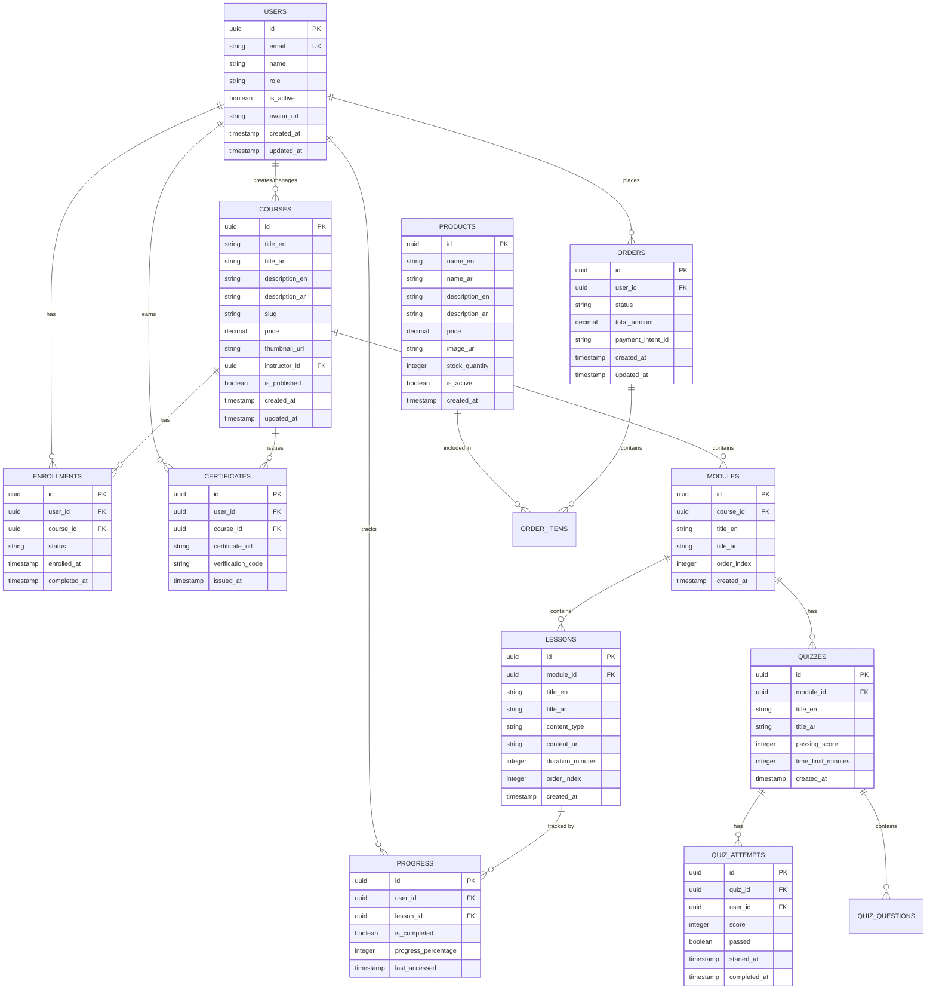

# Neon | نيون - Build From Scratch Plan

## Executive Summary

Neon is a bilingual (Arabic/English) educational platform that combines a Learning Management System (LMS) with an integrated e-commerce store. The platform enables students to access courses, track their progress, complete quizzes, and purchase educational materials, while providing administrators with comprehensive tools for content management and analytics.

**Target Market**: Educational institutions, individual learners, and content creators in the MENA region seeking a modern, bilingual learning experience with integrated commerce capabilities.

## Tech Stack

* **Frontend**: Next.js 14+ (App Router), TypeScript, Tailwind CSS

* **UI Components**: shadcn/ui for consistent, accessible components

* **Database**: Neon Postgres (Serverless PostgreSQL)

* **ORM**: Drizzle ORM for type-safe database operations

* **Authentication**: NextAuth.js (or similar) for secure user management

* **Payments**: Stripe integration (with both mock and real payment options)

* **Internationalization**: next-i18next for Arabic/English support

* **State Management**: React Context + Server Components

* **File Storage**: Vercel Blob or AWS S3 for course materials

## Database Architecture

### Core Entities



### Data Definition Language (DDL)

```sql
-- Users Table
CREATE TABLE users (
    id UUID PRIMARY KEY DEFAULT gen_random_uuid(),
    email VARCHAR(255) UNIQUE NOT NULL,
    name VARCHAR(255) NOT NULL,
    password_hash VARCHAR(255) NOT NULL,
    role VARCHAR(50) DEFAULT 'student' CHECK (role IN ('student', 'instructor', 'admin')),
    is_active BOOLEAN DEFAULT true,
    avatar_url TEXT,
    created_at TIMESTAMP WITH TIME ZONE DEFAULT NOW(),
    updated_at TIMESTAMP WITH TIME ZONE DEFAULT NOW()
);

-- Courses Table
CREATE TABLE courses (
    id UUID PRIMARY KEY DEFAULT gen_random_uuid(),
    title_en VARCHAR(255) NOT NULL,
    title_ar VARCHAR(255) NOT NULL,
    description_en TEXT,
    description_ar TEXT,
    slug VARCHAR(255) UNIQUE NOT NULL,
    price DECIMAL(10,2) DEFAULT 0.00,
    thumbnail_url TEXT,
    instructor_id UUID REFERENCES users(id),
    is_published BOOLEAN DEFAULT false,
    created_at TIMESTAMP WITH TIME ZONE DEFAULT NOW(),
    updated_at TIMESTAMP WITH TIME ZONE DEFAULT NOW()
);

-- Modules Table
CREATE TABLE modules (
    id UUID PRIMARY KEY DEFAULT gen_random_uuid(),
    course_id UUID REFERENCES courses(id) ON DELETE CASCADE,
    title_en VARCHAR(255) NOT NULL,
    title_ar VARCHAR(255) NOT NULL,
    order_index INTEGER NOT NULL,
    created_at TIMESTAMP WITH TIME ZONE DEFAULT NOW()
);

-- Lessons Table
CREATE TABLE lessons (
    id UUID PRIMARY KEY DEFAULT gen_random_uuid(),
    module_id UUID REFERENCES modules(id) ON DELETE CASCADE,
    title_en VARCHAR(255) NOT NULL,
    title_ar VARCHAR(255) NOT NULL,
    content_type VARCHAR(50) NOT NULL CHECK (content_type IN ('video', 'text', 'pdf', 'quiz')),
    content_url TEXT,
    duration_minutes INTEGER DEFAULT 0,
    order_index INTEGER NOT NULL,
    created_at TIMESTAMP WITH TIME ZONE DEFAULT NOW()
);

-- Enrollments Table
CREATE TABLE enrollments (
    id UUID PRIMARY KEY DEFAULT gen_random_uuid(),
    user_id UUID REFERENCES users(id) ON DELETE CASCADE,
    course_id UUID REFERENCES courses(id) ON DELETE CASCADE,
    status VARCHAR(50) DEFAULT 'active' CHECK (status IN ('active', 'completed', 'suspended')),
    enrolled_at TIMESTAMP WITH TIME ZONE DEFAULT NOW(),
    completed_at TIMESTAMP WITH TIME ZONE,
    UNIQUE(user_id, course_id)
);

-- Progress Table
CREATE TABLE progress (
    id UUID PRIMARY KEY DEFAULT gen_random_uuid(),
    user_id UUID REFERENCES users(id) ON DELETE CASCADE,
    lesson_id UUID REFERENCES lessons(id) ON DELETE CASCADE,
    is_completed BOOLEAN DEFAULT false,
    progress_percentage INTEGER DEFAULT 0 CHECK (progress_percentage >= 0 AND progress_percentage <= 100),
    last_accessed TIMESTAMP WITH TIME ZONE DEFAULT NOW(),
    UNIQUE(user_id, lesson_id)
);

-- Products Table
CREATE TABLE products (
    id UUID PRIMARY KEY DEFAULT gen_random_uuid(),
    name_en VARCHAR(255) NOT NULL,
    name_ar VARCHAR(255) NOT NULL,
    description_en TEXT,
    description_ar TEXT,
    price DECIMAL(10,2) NOT NULL,
    image_url TEXT,
    stock_quantity INTEGER DEFAULT 0,
    is_active BOOLEAN DEFAULT true,
    created_at TIMESTAMP WITH TIME ZONE DEFAULT NOW(),
    updated_at TIMESTAMP WITH TIME ZONE DEFAULT NOW()
);

-- Orders Table
CREATE TABLE orders (
    id UUID PRIMARY KEY DEFAULT gen_random_uuid(),
    user_id UUID REFERENCES users(id) ON DELETE CASCADE,
    status VARCHAR(50) DEFAULT 'pending' CHECK (status IN ('pending', 'paid', 'shipped', 'delivered', 'cancelled')),
    total_amount DECIMAL(10,2) NOT NULL,
    payment_intent_id VARCHAR(255),
    created_at TIMESTAMP WITH TIME ZONE DEFAULT NOW(),
    updated_at TIMESTAMP WITH TIME ZONE DEFAULT NOW()
);

-- Order Items Table
CREATE TABLE order_items (
    id UUID PRIMARY KEY DEFAULT gen_random_uuid(),
    order_id UUID REFERENCES orders(id) ON DELETE CASCADE,
    product_id UUID REFERENCES products(id),
    course_id UUID REFERENCES courses(id),
    quantity INTEGER NOT NULL DEFAULT 1,
    price DECIMAL(10,2) NOT NULL,
    CHECK (product_id IS NOT NULL OR course_id IS NOT NULL)
);

-- Certificates Table
CREATE TABLE certificates (
    id UUID PRIMARY KEY DEFAULT gen_random_uuid(),
    user_id UUID REFERENCES users(id) ON DELETE CASCADE,
    course_id UUID REFERENCES courses(id) ON DELETE CASCADE,
    certificate_url TEXT,
    verification_code VARCHAR(255) UNIQUE NOT NULL,
    issued_at TIMESTAMP WITH TIME ZONE DEFAULT NOW(),
    UNIQUE(user_id, course_id)
);

-- Create Indexes for Performance
CREATE INDEX idx_courses_instructor ON courses(instructor_id);
CREATE INDEX idx_courses_published ON courses(is_published);
CREATE INDEX idx_enrollments_user ON enrollments(user_id);
CREATE INDEX idx_enrollments_course ON enrollments(course_id);
CREATE INDEX idx_progress_user ON progress(user_id);
CREATE INDEX idx_progress_lesson ON progress(lesson_id);
CREATE INDEX idx_orders_user ON orders(user_id);
CREATE INDEX idx_orders_status ON orders(status);
```

## Project Structure

```CQL
neon-platform/
├── app/
│   ├── (auth)/
│   │   ├── login/
│   │   ├── register/
│   │   └── forgot-password/
│   ├── (dashboard)/
│   │   ├── admin/
│   │   │   ├── courses/
│   │   │   ├── users/
│   │   │   ├── analytics/
│   │   │   └── settings/
│   │   ├── instructor/
│   │   │   ├── courses/
│   │   │   ├── students/
│   │   │   └── earnings/
│   │   └── student/
│   │       ├── my-courses/
│   │       ├── certificates/
│   │       └── profile/
│   ├── (store)/
│   │   ├── products/
│   │   ├── cart/
│   │   ├── checkout/
│   │   └── orders/
│   ├── (learning)/
│   │   ├── courses/
│   │   ├── course/[slug]/
│   │   ├── lesson/[id]/
│   │   └── quiz/[id]/
│   ├── api/
│   │   ├── auth/[...nextauth]/
│   │   ├── courses/
│   │   ├── progress/
│   │   ├── orders/
│   │   └── webhooks/
│   ├── layout.tsx
│   ├── page.tsx
│   └── globals.css
├── components/
│   ├── ui/
│   │   └── (shadcn components)
│   ├── auth/
│   ├── courses/
│   ├── store/
│   ├── dashboard/
│   └── shared/
├── lib/
│   ├── db/
│   │   ├── schema.ts
│   │   ├── queries.ts
│   │   └── mutations.ts
│   ├── auth/
│   ├── utils/
│   ├── validations/
│   └── constants/
├── hooks/
├── types/
├── public/
│   ├── images/
│   ├── fonts/
│   └── locales/
│       ├── en/
│       └── ar/
├── styles/
├── tests/
├── scripts/
├── drizzle/
├── .env.local
├── next.config.js
├── tailwind.config.ts
├── tsconfig.json
└── package.json
```

## Implementation Roadmap

### Phase 1: Foundation (Weeks 1-2)

**Objectives**: Establish core infrastructure and basic functionality

**Tasks**:

* [ ] Initialize Next.js 14+ project with TypeScript and App Router

* [ ] Configure Tailwind CSS and shadcn/ui components

* [ ] Set up Neon Postgres database and Drizzle ORM

* [ ] Implement NextAuth.js with email/password authentication

* [ ] Configure next-i18next for Arabic/English support

* [ ] Create base layout components with RTL/LTR support

* [ ] Set up environment variables and configuration

* [ ] Implement basic user registration and login flows

**Deliverables**: Working authentication system, bilingual UI framework, database connection

### Phase 2: Core LMS (Weeks 3-4)

**Objectives**: Build essential learning management features

**Tasks**:

* [ ] Create course listing and detail pages

* [ ] Implement course enrollment system

* [ ] Build lesson player with video/text/pdf support

* [ ] Create progress tracking system

* [ ] Implement basic quiz functionality

* [ ] Add course search and filtering

* [ ] Create student dashboard with enrolled courses

* [ ] Build instructor course management interface

**Deliverables**: Functional course delivery system, progress tracking, basic assessment

### Phase 3: E-commerce (Weeks 5-6)

**Objectives**: Integrate store functionality for monetization

**Tasks**:

* [ ] Create product catalog with bilingual support

* [ ] Implement shopping cart functionality

* [ ] Build checkout process with Stripe integration

* [ ] Add order management system

* [ ] Create product detail pages

* [ ] Implement inventory management

* [ ] Add order history for users

* [ ] Create sales analytics for instructors

**Deliverables**: Complete e-commerce flow, payment processing, order management

### Phase 4: Admin Dashboard (Weeks 7-8)

**Objectives**: Provide comprehensive administrative tools

**Tasks**:

* [ ] Build admin user management interface

* [ ] Create course CRUD operations

* [ ] Implement user role management

* [ ] Add platform analytics dashboard

* [ ] Create content moderation tools

* [ ] Build financial reporting system

* [ ] Implement bulk operations

* [ ] Add system configuration management

**Deliverables**: Full administrative control panel, analytics, content management

### Phase 5: Polish & V2 (Weeks 9-10)

**Objectives**: Enhance user experience and add advanced features

**Tasks**:

* [ ] Implement certificate generation and verification

* [ ] Create public certificate verification page

* [ ] Add course reviews and ratings

* [ ] Implement learning challenges/gamification

* [ ] Create mobile-responsive optimizations

* [ ] Add advanced search and recommendations

* [ ] Implement notification system

* [ ] Performance optimization and caching

**Deliverables**: Professional-grade platform with advanced features

## Key Technical Decisions

### RTL/LTR Handling

**Strategy**: Implement a comprehensive bidirectional text support system

**Implementation**:

* Use CSS logical properties for spacing and alignment

* Implement dynamic direction switching based on locale

* Create utility functions for text alignment and layout

* Use Next.js middleware for locale-based routing

* Implement font switching for Arabic/English content

**Code Example**:

```typescript
// utils/i18n.ts
export const getDirection = (locale: string) => locale === 'ar' ? 'rtl' : 'ltr';

// components/LocalizedText.tsx
export function LocalizedText({ ar, en }: { ar: string; en: string }) {
  const { locale } = useRouter();
  return <span className={locale === 'ar' ? 'text-right' : 'text-left'}>
    {locale === 'ar' ? ar : en}
  </span>;
}
```

### Server Components vs Client Components

**Strategy**: Maximize Server Components for performance, use Client Components only when necessary

**Server Components**:

* Course listings and static content

* User dashboards with initial data

* Product catalogs

* SEO-critical pages

**Client Components**:

* Authentication flows

* Interactive elements (quizzes, forms)

* Real-time progress tracking

* Shopping cart state management

### Data Fetching Patterns

**Strategy**: Leverage Next.js 13+ Server Actions and Server Components

**Implementation**:

```typescript
// Server Action for course enrollment
export async function enrollInCourse(courseId: string) {
  const session = await getServerSession();
  if (!session?.user) throw new Error('Unauthorized');
  
  return await db.insert(enrollments).values({
    userId: session.user.id,
    courseId,
    enrolledAt: new Date()
  });
}

// Server Component with data
export default async function CoursePage({ params }: { params: { slug: string } }) {
  const course = await db.query.courses.findFirst({
    where: eq(courses.slug, params.slug)
  });
  
  return <CourseDetails course={course} />;
}
```

## Testing & Deployment Strategy

### Testing Approach

**Unit Testing**:

* Jest for utility functions and hooks

* React Testing Library for components

* Drizzle test utilities for database operations

**Integration Testing**:

* Next.js testing utilities for API routes

* Playwright for end-to-end user flows

* Stripe test mode for payment flows

**Performance Testing**:

* Lighthouse CI for performance metrics

* Bundle analyzer for optimization

* Database query performance monitoring

### Deployment Pipeline

**Development**:

* Local development with Docker for database

* Hot reload for rapid iteration

* Storybook for component development

**Staging**:

* Vercel preview deployments for PRs

* Automated testing on push

* Database migrations in staging environment

**Production**:

* Vercel for frontend hosting

* Neon Postgres for production database

* Stripe live mode with webhook handling

* CDN for static assets and course materials

**Monitoring**:

* Vercel Analytics for performance monitoring

* Sentry for error tracking

* Database performance monitoring

* User analytics with privacy compliance

### Security Considerations

**Authentication**:

* JWT tokens with secure refresh mechanism

* Rate limiting on auth endpoints

* Password complexity requirements

* Session management with secure cookies

**Data Protection**:

* Row-level security in PostgreSQL

* Input validation and sanitization

* HTTPS enforcement

* GDPR compliance for user data

**Payment Security**:

* PCI DSS compliance through Stripe

* No credit card data stored locally

* Secure webhook signature verification

* Payment fraud detection

## Conclusion

This build plan provides a comprehensive roadmap for developing the Neon educational platform from scratch. The phased approach ensures systematic development while maintaining flexibility for adjustments based on user feedback and market needs. The technical decisions prioritize performance, security, and user experience while leveraging modern web development best practices.

The platform's bilingual nature and integrated e-commerce capabilities position it uniquely in the MENA educational technology market, providing a solid foundation for scalable growth and feature expansion.
